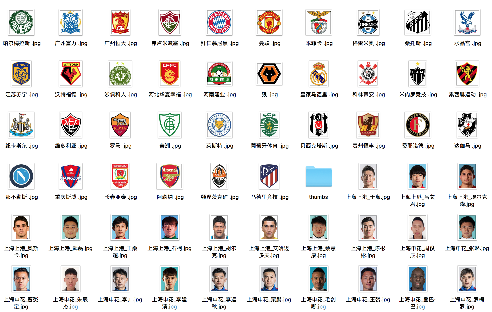
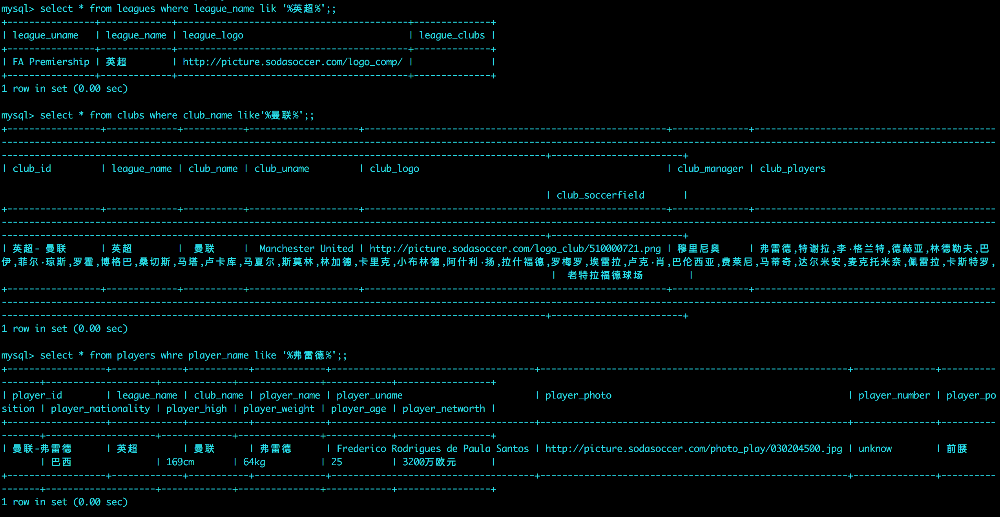

一、项目介绍

通过sodasoccer.com爬虫主要联赛、联赛球队及球员信息分表存入MySQL，将logo、照片下载到本地。

二、效果图

图片下载效果：




数据库一览：



## 三、部署

### 3.1 部署依赖

请先部署mysql、redis、proxy_pool服务，推荐以docker方式部署

1)mysql、redis部署，参考官方文档；

2)proxy_pool部署，参考链接：
https://github.com/jhao104/proxy_pool?tab=readme-ov-file#docker-image

### 3.2 获取代码

```bash
git clone https://github.com/sunnywalden/leauges.git
```
### 3.3 安装依赖

```bash
pip install -r requirements.txt
```

### 3.4 运行项目

```bash
scrapy crawl leagues
```


## 四、感谢

代理使用了jhao104的[proxy_pool](https://github.com/jhao104/proxy_pool)项目，在此感谢！
